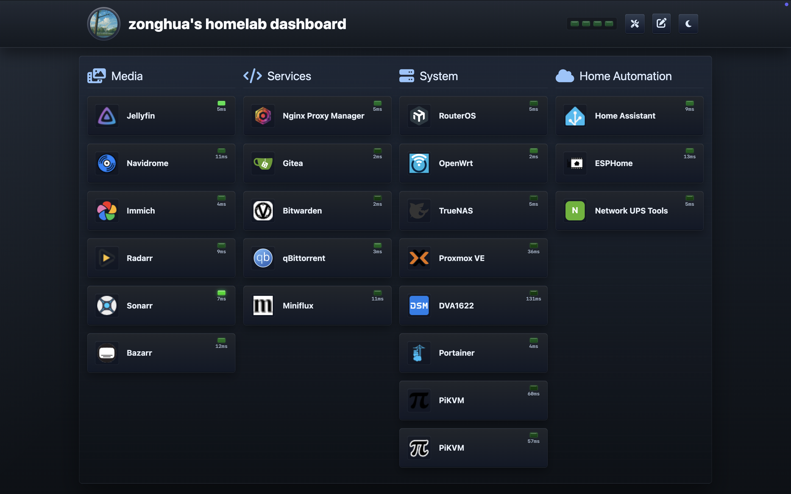
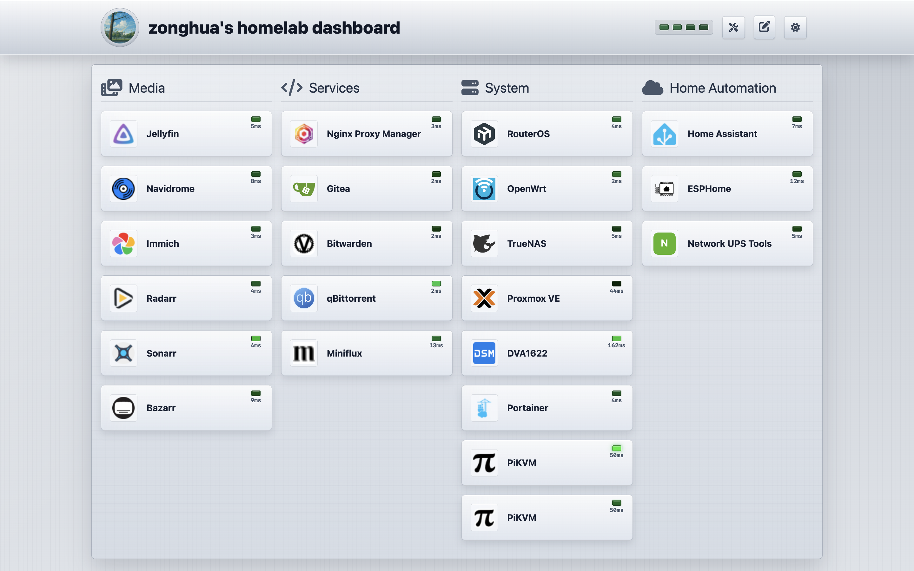

# Homelab Dashboard

[](https://hub.docker.com/r/zouzonghua/homelab-dashboard)
[](https://github.com/zouzonghua/homelab-dashboard/releases)
[](LICENSE)

English | [简体中文](README.zh-CN.md)

A modern homelab dashboard for managing and monitoring self-hosted services.

## Live Preview

[https://homelab.zouzonghua.cn](https://homelab.zouzonghua.cn)

## Preview





## Features

- [x] 🎯 One-click access to common services
- [x] 🌙 Dark mode support
- [x] 📱 Responsive layout for mobile devices
- [x] 📄 Config import and export
- [x] 🔧 Service editing
- [x] 🔄 Real-time service status
- [x] 🐳 Docker deployment
- [ ] 📊 System resource monitoring (TODO)
- [ ] 🔐 Secure authentication (TODO)

## Quick Start

Make sure Node.js, Go, and a package manager are installed.

```bash
# Clone the repository
git clone https://github.com/zouzonghua/homelab-dashboard.git

# Enter the project directory
cd homelab-dashboard

# Install frontend dependencies
npm --prefix web install

# Start the frontend dev server
npm --prefix web run dev

# Start the local Go API in another terminal
npm --prefix web run dev:api

# Start the Go API with the React production build
npm --prefix web run e2e:server

# Build for production
npm --prefix web run build

# Preview the production build
npm --prefix web run preview
```

## Backend And Persistence

The project includes a Go API with SQLite persistence:

- OpenAPI v1 contract: `api/openapi.yaml`
- Resource-based API v1: `/api/v1/dashboard`, `/api/v1/categories`, `/api/v1/services`, `/api/v1/status`
- Config import/export API: `GET /api/v1/export`, `PUT /api/v1/import`
- Default database path: `data/homelab.db`
- Default seed: embedded backend seed at `internal/config/default-dashboard.json`
- Default static directory: `web/dist`
- Default port: `8080`

Override defaults with environment variables:

```bash
HOMELAB_DB_PATH=.tmp/homelab.db HOMELAB_STATIC_DIR=web/dist PORT=8080 go run ./cmd/server
```

On first startup, an empty SQLite database is initialized from the embedded seed. To override the seed, set `HOMELAB_SEED_PATH=/path/to/dashboard.json`.

Docker is not required for local development. The usual local setup uses two terminals:

```bash
# Recommended: start the Go API and Vite frontend together
make dev
```

You can also run them separately:

```bash
# Terminal 1: Go API on port 8080
go run ./cmd/server

# Terminal 2: Vite frontend on port 5173 with /api proxied to 8080
npm --prefix web run dev
```

Open `http://localhost:5173`. Docker is mainly used for release packaging or container deployment verification.

## Deployment

### Manual Deployment

1. Build the project:

```bash
npm --prefix web run build
```

2. Deploy the files in `web/dist` to your web server.

### Docker Deployment

```bash
# Use the published image
docker run -d \
  --name homelab-dashboard \
  -p 8080:8080 \
  -v "$(pwd)/data:/data" \
  --restart unless-stopped \
  zouzonghua/homelab-dashboard:latest
```

You can also use Docker Compose:

```bash
docker compose -f deploy/compose.yml up -d
```

Verify a local image build:

```bash
docker compose -f deploy/compose.yml up --build
```

Open `http://localhost:8080`. SQLite data is stored in `data/homelab.db`, and automatically fetched favicons are cached in `data/icons/`, which makes the data easy to inspect with tools such as DBeaver.

### Docker Image Publishing

GitHub Actions publishes images to Docker Hub in these cases:

- Pushes to `main`: publishes `zouzonghua/homelab-dashboard:latest`
- `v*.*.*` tags or GitHub Releases: publishes version tags such as `1.2.3`, `v1.2.3`, and `1.2`
- Manual `Publish Docker image` workflow runs

The publishing workflow builds `linux/amd64` and `linux/arm64` images and writes the image digest and tag list to the GitHub Actions summary. Tests and type checks are handled by the CI workflow; the Docker publishing workflow only builds and pushes images.

Required repository secrets:

- `DOCKER_HUB_USERNAME`
- `DOCKER_HUB_ACCESS_TOKEN`

## Testing

```bash
# Validate the OpenAPI YAML
ruby -e "require 'yaml'; YAML.load_file('api/openapi.yaml')"

# Go unit and integration tests
go test ./cmd/... ./internal/...

# Frontend unit tests
npm --prefix web test

# E2E tests
npm --prefix web run test:e2e
```

## Configuration

Configuration is persisted in SQLite. You can export a legacy-compatible JSON config with `GET /api/v1/export`, and import a replacement config with `PUT /api/v1/import`:

```javascript
{
  "title": "zonghua's homelab dashboard", // Dashboard title
  "columns": "4", // Column count
  "items": [
    // Service categories
    {
      "name": "Media", // Category name
      "icon": "fa-solid fa-photo-film", // Icon
      "list": [
        {
          "name": "Jellyfin", // Service name
          "logo": "", // Leave blank to fetch the favicon, or provide an icon URL
          "url": "http://192.168.1.203:8096", // Service URL
          "target": "_blank" // Open behavior
        }
      ]
    },
  ]
}
```

## Tech Stack

- 🚀 [Vite](https://vitejs.dev/) - Next-generation frontend tooling
- ⚛️ [React 18](https://reactjs.org/) - UI library
- 🎨 [TailwindCSS](https://tailwindcss.com/) - Utility-first CSS framework
- 🔍 [ESLint](https://eslint.org/) - Code quality checks
- 🎯 [PostCSS](https://postcss.org/) - CSS transforms
- 📦 [Autoprefixer](https://github.com/postcss/autoprefixer) - Automatic CSS prefixes
- 🎁 [Font Awesome](https://fontawesome.com/) - Icon library

## Contributing

Pull requests and issues are welcome.

1. Fork this repository
2. Create your feature branch (`git checkout -b feature/AmazingFeature`)
3. Commit your changes (`git commit -m 'Add some AmazingFeature'`)
4. Push to the branch (`git push origin feature/AmazingFeature`)
5. Open a pull request

## License

[](https://github.com/zouzonghua/homelab-dashboard/blob/main/LICENSE)

Copyright (c) 2021 - Now zouzonghua
